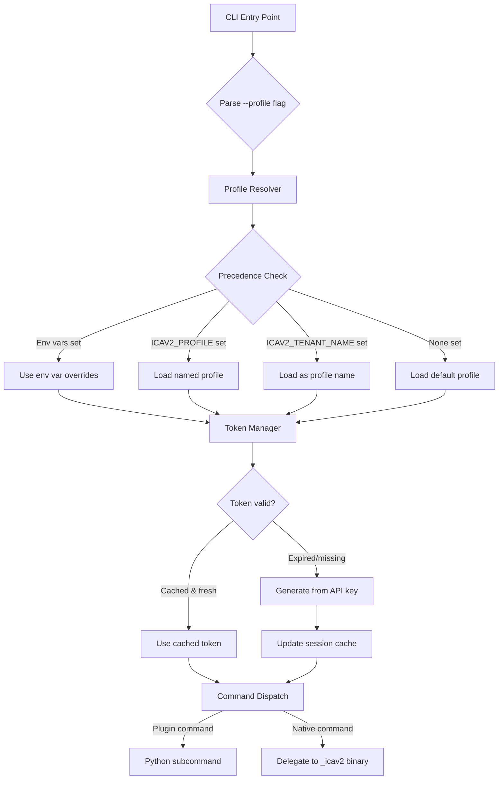

# Design Document: Profile-Based Configuration

## Overview

This design replaces the shell-function-based tenant/project context management system with an AWS CLI-style profile configuration approach. The new system stores named profiles in an INI-style config file at `~/.icav2-cli-plugins/config`, selects profiles via the `ICAV2_PROFILE` environment variable or `--profile` CLI flag, bundles the `icav2` binary locally, and optimizes startup performance through lazy imports.

The key architectural shift: instead of requiring users to source shell functions that export environment variables into the current shell, the CLI itself becomes a standalone executable that reads configuration from disk and manages token lifecycle internally. This enables usage in subshells, scripts, CI/CD pipelines, and any context where sourcing shell functions is impractical.

### Design Goals

- **Standalone operation**: No shell function sourcing required
- **Multi-tenant support**: Named profiles for switching between ICAv2 tenants/projects
- **Backward compatibility**: Existing `ICAV2_ACCESS_TOKEN`, `ICAV2_PROJECT_ID`, `ICAV2_BASE_URL`, and `ICAV2_TENANT_NAME` environment variables continue to work
- **Fast startup**: Help/version in <500ms via lazy imports
- **Self-contained**: Bundled icav2 binary removes external dependency

## Architecture



### Directory Layout

```
~/.icav2-cli-plugins/
├── config                          # INI-style profile configuration
├── bin/
│   └── _icav2                      # Bundled icav2 binary
├── cache/
│   └── <profile_name>/
│       └── session.yaml            # Cached access token per profile
└── tenants/                        # Legacy (preserved for migration)
```

## Components and Interfaces

### 1. Config File Parser (`utils/config_parser.py`)

A dedicated INI parser that handles the AWS-style profile format.

```python
from dataclasses import dataclass, field
from typing import Dict, Optional, List
from pathlib import Path


@dataclass
class ProfileConfig:
    """Represents a single parsed profile."""
    name: str
    server_url: str = "ica.illumina.com"
    x_api_key: Optional[str] = None
    project_id: Optional[str] = None
    project_name: Optional[str] = None
    token_tid: Optional[str] = None
    output_format: str = "table"


class ConfigParseError(Exception):
    """Raised when config file contains malformed content."""
    def __init__(self, line_number: int, line_content: str, message: str):
        self.line_number = line_number
        self.line_content = line_content
        super().__init__(f"Line {line_number}: {message}: {line_content!r}")


class ConfigParser:
    """
    Parses ~/.icav2-cli-plugins/config in AWS-style INI format.
    
    Sections:
      [default]            -> default profile
      [profile my-tenant]  -> named profile "my-tenant"
    
    Keys: key = value (whitespace trimmed, comments with # or ;)
    """

    def parse(self, content: str) -> Dict[str, ProfileConfig]:
        """Parse config file content into profile dict."""
        ...

    def serialize(self, profiles: Dict[str, ProfileConfig]) -> str:
        """Serialize profiles back to INI format."""
        ...

    def parse_file(self, path: Path) -> Dict[str, ProfileConfig]:
        """Read and parse a config file from disk."""
        ...

    def write_file(self, path: Path, profiles: Dict[str, ProfileConfig]) -> None:
        """Serialize and write profiles to disk with mode 0600."""
        ...
```

**Design decisions:**
- Custom parser rather than `configparser` stdlib: The stdlib `configparser` doesn't support the `[profile name]` section naming convention natively. A lightweight custom parser gives us exact control over the format and better error messages with line numbers.
- Duplicate keys: last occurrence wins (matches AWS CLI behavior).

### 2. Profile Resolver (`utils/profile_resolver.py`)

Determines which profile to load based on the precedence chain.

```python
@dataclass
class ResolvedConfig:
    """Final resolved configuration after applying precedence."""
    profile_name: str
    server_url: str
    base_url: str
    access_token: Optional[str]
    project_id: Optional[str]
    api_key: Optional[str]
    output_format: str


class ProfileResolver:
    """
    Resolves the active configuration by applying precedence:
    1. Explicit env vars (ICAV2_ACCESS_TOKEN, ICAV2_PROJECT_ID, ICAV2_BASE_URL)
    2. --profile CLI flag or ICAV2_PROFILE env var
    3. ICAV2_TENANT_NAME env var (backward compat, treated as profile name)
    4. [default] profile in config file
    """

    def __init__(self, config_path: Path, cli_profile: Optional[str] = None):
        ...

    def resolve(self) -> ResolvedConfig:
        """Resolve configuration from all sources."""
        ...

    def _determine_profile_name(self) -> str:
        """Determine which profile to load from config."""
        ...

    def _apply_env_overrides(self, config: ResolvedConfig) -> ResolvedConfig:
        """Apply environment variable overrides on top of profile values."""
        ...
```

### 3. Token Manager (`utils/token_manager.py`)

Handles token caching, validation, and refresh.

```python
class TokenManager:
    """
    Manages access token lifecycle per profile.
    
    Cache location: ~/.icav2-cli-plugins/cache/<profile_name>/session.yaml
    Refresh threshold: 3600 seconds before expiry
    """

    def __init__(self, profile_name: str, cache_dir: Path):
        ...

    def get_valid_token(self, api_key: str, base_url: str) -> str:
        """
        Return a valid access token, using cache if fresh enough.
        Generates new token from API key if cache is stale/absent.
        """
        ...

    def _read_cache(self) -> Optional[str]:
        """Read cached token from session.yaml."""
        ...

    def _write_cache(self, token: str) -> None:
        """Write token to session.yaml with mode 0600."""
        ...

    def _is_token_fresh(self, token: str) -> bool:
        """Check if token has >3600 seconds until exp claim."""
        ...

    def _generate_token(self, api_key: str, base_url: str) -> str:
        """Generate new access token from API key via ICAv2 API."""
        ...
```

### 4. Standalone Entry Point (`utils/cli.py` refactored)

The main CLI entry point becomes self-contained — no shell functions needed.

```python
def main():
    """
    Standalone entry point for icav2-cli-plugins.
    
    1. Parse global args (--profile, --debug, command, subcommand)
    2. For help/version: respond immediately (no heavy imports)
    3. Resolve profile configuration
    4. Ensure valid access token
    5. Dispatch to plugin subcommand or delegate to local _icav2 binary
    """
    ...


def _dispatch_plugin_command(cmd: str, subcmd: str, args: list, config: ResolvedConfig):
    """Lazy-import and execute a plugin subcommand."""
    ...


def _delegate_to_icav2(args: list, config: ResolvedConfig):
    """
    Execute the bundled _icav2 binary with environment variables
    set from the resolved configuration.
    """
    ...
```

### 5. Configure Commands (`subcommands/configure/`)

New subcommand group for profile management.

```python
class ConfigureSet(Command):
    """
    Usage: icav2 configure set [<profile_name>]
    
    Interactively configure a profile. Prompts for server_url, x_api_key, 
    and project_name. Validates the API key before saving.
    """
    ...


class ConfigureList(Command):
    """
    Usage: icav2 configure list
    
    Display all configured profiles in a table.
    """
    ...
```

### 6. Lazy Import Dispatcher

Rather than importing all subcommand modules at startup, the dispatcher uses a mapping from command names to module paths and imports on demand.

```python
COMMAND_MODULE_MAP = {
    "bundles": "icav2_cli_plugins.subcommands.bundles",
    "pipelines": "icav2_cli_plugins.subcommands.pipelines",
    "projectanalyses": "icav2_cli_plugins.subcommands.projectanalyses",
    "projectdata": "icav2_cli_plugins.subcommands.projectdata",
    "projectpipelines": "icav2_cli_plugins.subcommands.projectpipelines",
    "tenants": "icav2_cli_plugins.subcommands.tenants",
    "configure": "icav2_cli_plugins.subcommands.configure",
}


def lazy_import_command(cmd: str):
    """Import the command module only when dispatched."""
    import importlib
    module_path = COMMAND_MODULE_MAP.get(cmd)
    if module_path is None:
        return None
    return importlib.import_module(module_path)
```

## Data Models

### Config File Format (INI)

```ini
# Default profile
[default]
server_url = ica.illumina.com
x_api_key = abc123...
project_id = proj-uuid-here
project_name = my-project
output_format = table

# Named profile
[profile production]
server_url = ica.illumina.com
x_api_key = def456...
project_id = proj-uuid-prod
project_name = production-project
token_tid = tenant-id-base64
output_format = json

# Another named profile
[profile staging]
server_url = ica.illumina.com
x_api_key = ghi789...
project_name = staging-project
```

### Session Cache Format (YAML)

```yaml
# ~/.icav2-cli-plugins/cache/<profile_name>/session.yaml
access_token: eyJhbGciOi...
token_epoch: 1704067200
```

### Profile Name Validation

- 1 to 64 characters
- Allowed characters: `[a-zA-Z0-9_-]`
- Regex: `^[a-zA-Z0-9][a-zA-Z0-9_-]{0,63}$`

### Configuration Precedence (highest to lowest)

| Priority | Source | Keys |
|----------|--------|------|
| 1 | Environment variables | `ICAV2_ACCESS_TOKEN`, `ICAV2_PROJECT_ID`, `ICAV2_BASE_URL` |
| 2 | `--profile` CLI flag | Selects profile from config |
| 3 | `ICAV2_PROFILE` env var | Selects profile from config |
| 4 | `ICAV2_TENANT_NAME` env var | Treated as profile name (backward compat) |
| 5 | `[default]` profile | Fallback |

## Correctness Properties

*A property is a characteristic or behavior that should hold true across all valid executions of a system — essentially, a formal statement about what the system should do. Properties serve as the bridge between human-readable specifications and machine-verifiable correctness guarantees.*

### Property 1: Config file round-trip

*For any* valid set of profile configurations (with valid profile names, supported keys, and valid values), serializing to INI format and then parsing the result SHALL produce a configuration object with identical section names, keys, and values as the original.

**Validates: Requirements 3.6, 3.1, 3.3, 3.5, 1.1, 1.2**

### Property 2: Comments do not affect parse result

*For any* valid config file content and any set of comment lines (lines starting with `#` or `;`), inserting those comment lines at any position in the config file SHALL produce the same parsed result as parsing the config without comments.

**Validates: Requirements 3.2**

### Property 3: Default values applied when keys absent

*For any* profile that omits the `server_url` key, the resolved server URL SHALL be `ica.illumina.com`; and *for any* profile that omits the `output_format` key, the resolved output format SHALL be `table`.

**Validates: Requirements 1.4, 1.5**

### Property 4: Profile selection resolves correct profile

*For any* config file containing multiple profiles and any valid profile name present in that config, setting `ICAV2_PROFILE` to that name SHALL load exactly the key-value pairs from that profile's section, and when `ICAV2_PROFILE` is unset or empty, the `[default]` profile SHALL be loaded.

**Validates: Requirements 2.1, 2.2**

### Property 5: Configuration precedence resolution

*For any* combination of environment variables (`ICAV2_ACCESS_TOKEN`, `ICAV2_PROJECT_ID`, `ICAV2_BASE_URL`), `--profile` flag, `ICAV2_PROFILE` env var, `ICAV2_TENANT_NAME` env var, and `[default]` profile values, the resolved configuration SHALL use the value from the highest-precedence source that provides a non-empty value for each configuration key.

**Validates: Requirements 2.5, 7.4, 9.1, 9.3, 9.4, 9.5, 9.6, 9.7**

### Property 6: Token cache freshness decision

*For any* JWT access token, if the `exp` claim minus current epoch time is greater than 3600 seconds, the token SHALL be considered fresh (use from cache); otherwise it SHALL be considered stale (regenerate from API key).

**Validates: Requirements 4.2, 4.3**

### Property 7: Invalid profile name produces error with available profiles

*For any* config file with N profiles (N ≥ 1) and any profile name string that does not match any profile in the config, attempting to resolve that profile SHALL produce an error that contains both the requested profile name and all available profile names.

**Validates: Requirements 2.4**

### Property 8: Output format validation

*For any* string value assigned to the `output_format` key, the config parser SHALL accept it if and only if it is one of `table`, `json`, or `yaml`.

**Validates: Requirements 1.6**

### Property 9: Duplicate keys resolve to last occurrence

*For any* config file section containing the same key K appearing N times (N ≥ 2) with values V₁, V₂, ..., Vₙ, the parsed section SHALL have K mapped to Vₙ (the last occurrence).

**Validates: Requirements 3.8**

### Property 10: Malformed lines produce parse errors with line info

*For any* line in a config file that is not blank, not a comment (starting with `#` or `;`), not a section header (starting with `[`), and does not contain a `=` delimiter, the parser SHALL raise a `ConfigParseError` that includes the line number.

**Validates: Requirements 3.7**

### Property 11: Expired/malformed JWT environment token is rejected without fallback

*For any* JWT string in `ICAV2_ACCESS_TOKEN` that is either expired (exp < current time) or not a valid JWT structure, the CLI SHALL reject it with an error and SHALL NOT fall back to loading a token from the profile or cache.

**Validates: Requirements 9.2**

## Error Handling

### Error Categories

| Category | Behavior | Example |
|----------|----------|---------|
| Config file missing | Exit with code 1, message includes path | `~/.icav2-cli-plugins/config not found` |
| Config parse error | Exit with code 1, message includes line number | `Line 5: no = delimiter found` |
| Profile not found | Exit with code 1, list available profiles | `Profile 'foo' not found. Available: default, staging` |
| Token expired (env var) | Exit with code 1, reject without fallback | `ICAV2_ACCESS_TOKEN is expired or malformed` |
| Token generation failure | Exit with code 1, include profile + server URL | `Failed to generate token for profile 'prod' at ica.illumina.com` |
| Local binary missing | Exit with code 1, suggest re-run installer | `_icav2 binary not found. Run install.sh` |
| No profile resolvable | Exit with code 1, guidance message | `No profile configured. Run 'icav2 configure set'` |

### Error Strategy

- All errors write to stderr and exit with non-zero status
- Error messages are actionable: they include what went wrong and how to fix it
- No silent failures: malformed cache files trigger regeneration with a warning, not silent corruption
- Token validation failures are hard errors when the token comes from an explicit env var (user intent is clear)

## Testing Strategy

### Property-Based Tests

Property-based testing is well-suited for this feature because the core components (config parser, profile resolver, token freshness logic) are pure functions or have clear input/output behavior with large input spaces (arbitrary profile names, config content, JWT tokens, env var combinations).

**Library:** `hypothesis` (Python PBT library)

**Configuration:**
- Minimum 100 iterations per property test
- Each property test references its design document property via comment tag
- Tag format: `# Feature: profile-based-config, Property {N}: {title}`

**Properties to implement:**
1. Config round-trip (Property 1)
2. Comment invariance (Property 2)  
3. Default value resolution (Property 3)
4. Profile selection (Property 4)
5. Precedence resolution (Property 5)
6. Token freshness decision (Property 6)
7. Invalid profile error (Property 7)
8. Output format validation (Property 8)
9. Duplicate key resolution (Property 9)
10. Malformed line detection (Property 10)
11. JWT rejection without fallback (Property 11)

### Unit Tests (Example-Based)

- Config file path constant resolves correctly
- `[default]` section recognized as default profile
- `configure list` output format with sample profiles
- `configure list` empty state message
- Help/version respond without importing heavy libraries
- Delegation to `_icav2` binary uses correct path and env vars
- Session cache YAML format contains expected keys

### Integration Tests

- Token generation via mocked HTTP endpoint
- `configure set` interactive flow with mocked stdin
- File permissions set correctly (0600 for config, 0755 for binary)
- Installer directory structure creation
- Migration prompt when tenants/ directory detected

### Performance Tests (Smoke)

- `icav2 help` completes in < 500ms
- `icav2 version` completes in < 500ms
- Verify heavy libraries not in `sys.modules` after help/version
